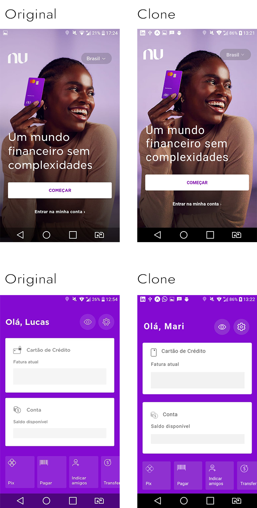

# Grupo 5 de React Native - Turma de Terê 02 do Serratec edição 2021.1

* Caio Mendes Da Silva
* Carlos Eduardo Da Silva Bertanholi
* Jéssica Dos Santos Silvano
* Leandro Moreira Camargo
* Lucas Da Silva Cruz
* Thiene Pereira Alves
* Waldevino Bandeira Mendes

# O projeto

A ideia surgiu quando um membro da equipe recebeu um e-mail de comemoração a 1 ano com o roxinho, então o grupo resolveu clonar o app em homenagem à revolução bancária que devolveu às pessoas o controle sobre a vida financeira.

As telas que mais pareciam interessantes de desenvolver com a nossa experiência de 1 ano com o React Native foram as duas telas iniciais, antes e depois de logar.

Por isso, apesar de não existir propiamente um link entre elas, pulamos a tela de e-mail/senha e fomos direto à segunda tela inicial quando o botão "Entrar na minha conta > " é pressionado.

# Resultado

